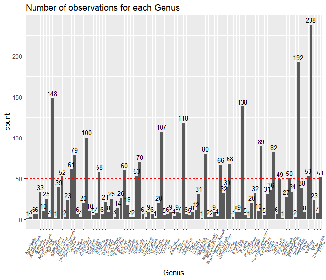
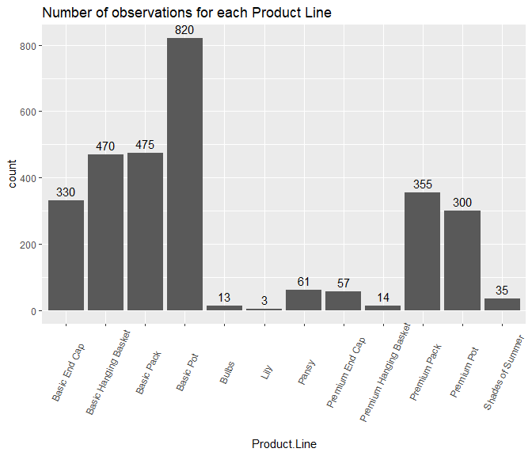
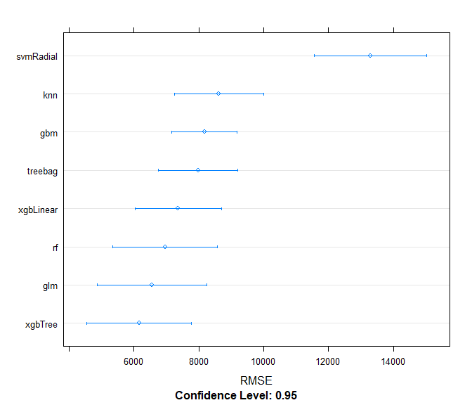
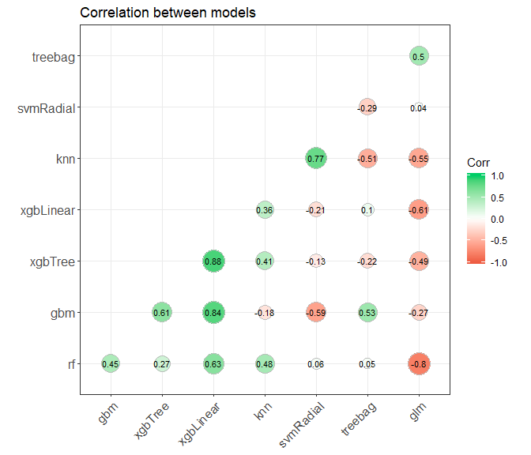
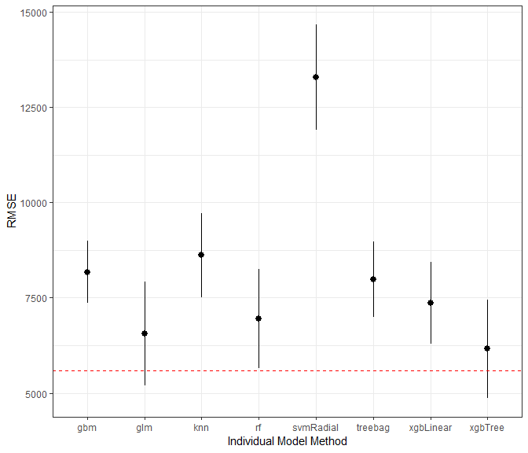

#### Load Data and look at data structure

```r
setwd("C:\\Users\\user\\Documents\\Datalore Projects\\Sales Plan\\")
options(scipen = 999)
sales_raw <- read.csv("salesplandata.csv",stringsAsFactors=FALSE,fileEncoding="UTF-8-BOM")
str(sales_raw)
```

```
## 'data.frame':	4090 obs. of  29 variables:
##  $ Production.Year          : int  2019 2019 2019 2019 2017 2019 2018 2018 2017 2019 ...
##  $ Production.Month         : int  2 2 2 2 2 7 3 2 3 3 ...
##  $ Product.Line             : chr  "Premium Pot" "Premium End Cap" "Premium Pot" "Basic End Cap" ...
##  $ Genus                    : chr  "Ipomoea" "Begonia" "Ipomoea" "Sunpatiens" ...
##  $ SalesPlanQty             : int  2500 2000 2500 2000 2000 1500 0 0 500 2000 ...
##  $ LYSalesPlanQty           : int  2500 2500 2500 2500 2500 2500 2500 2500 2500 2500 ...
##  $ L2YSalesPlanQty          : int  2500 2000 2500 2000 2500 1500 0 0 0 2000 ...
##  $ CustomerComp             : num  NA -0.9556 NA -0.0529 -0.0226 ...
##  $ GenusComp                : num  -0.0487 -0.0563 -0.0487 -0.057 -0.057 ...
##  $ ProductLineComp          : num  -0.0609 -0.0659 -0.0609 -0.0126 -0.0431 ...
##  $ CustomerMarginPerc       : num  0.263 -0.198 0.416 0.35 0.383 ...
##  $ CustomerMarginPercAllYear: num  0.2629 0.0953 0.416 0.3263 0.3884 ...
##  $ CustomerST               : num  NA NA NA 0.843 1.187 ...
##  $ CustomerSTAllYear        : num  NA NA NA 0.915 0.911 ...
##  $ Customer.POS.Qty         : int  8 20 7 1832 1111 2273 19 416 137 191 ...
##  $ Shipped.Qty              : int  0 0 0 2172 936 1638 324 1440 1092 594 ...
##  $ Loss..                   : num  NA -1 NA -0.00429 -0.0017 ...
##  $ PriorMonthPOS            : int  0 162 0 1516 3004 4544 -7 154 -25 0 ...
##  $ Prior2MonthPOS           : int  0 0 0 0 0 5432 -6 0 -7 0 ...
##  $ Prior3MonthPOS           : int  0 0 0 0 0 2402 0 0 0 0 ...
##  $ PostMonthPOS             : int  0 0 0 2092 1269 484 734 2838 1512 48 ...
##  $ Post2MonthPOS            : int  0 0 0 3220 2484 31 2518 8249 2256 1 ...
##  $ Post3MonthPOS            : int  0 0 0 3580 2095 -2 1618 18134 3719 -3 ...
##  $ PriorMonthShipped        : int  0 0 0 984 1644 2322 0 420 0 0 ...
##  $ Prior2MonthShipped       : int  0 0 0 0 0 5742 0 0 0 0 ...
##  $ Prior3MonthShipped       : int  0 0 0 0 0 5310 0 0 0 0 ...
##  $ PostMonthShipped         : int  0 0 0 3336 2448 0 1860 4200 1476 0 ...
##  $ Post2MonthShipped        : int  0 0 0 3036 2904 0 2964 18190 3576 0 ...
##  $ Post3MonthShipped        : int  0 0 0 3708 2448 0 708 18950 3456 0 ...
```
#### Create Index To Split Data Into Testing and Training Sets Later

```r
sales_raw$ID <- seq.int(nrow(sales_raw))
```

#### Remove unneeded columns

```r
sales_data <- sales_raw%>%
  filter(SalesPlanQty>0)
```
#### Check null values and exclude from dataset

```r
colSums(sapply(sales_data,is.na))
```

```
##           Production.Year          Production.Month 
##                         0                         0 
##              Product.Line                     Genus 
##                         0                         0 
##              SalesPlanQty            LYSalesPlanQty 
##                         0                         0 
##           L2YSalesPlanQty              CustomerComp 
##                         0                       397 
##                 GenusComp           ProductLineComp 
##                         0                         0 
##        CustomerMarginPerc CustomerMarginPercAllYear 
##                         0                         0 
##                CustomerST         CustomerSTAllYear 
##                       211                        74 
##          Customer.POS.Qty               Shipped.Qty 
##                         0                         0 
##                    Loss..             PriorMonthPOS 
##                       375                         0 
##            Prior2MonthPOS            Prior3MonthPOS 
##                         0                         0 
##              PostMonthPOS             Post2MonthPOS 
##                         0                         0 
##             Post3MonthPOS         PriorMonthShipped 
##                         0                         0 
##        Prior2MonthShipped        Prior3MonthShipped 
##                         0                         0 
##          PostMonthShipped         Post2MonthShipped 
##                         0                         0 
##         Post3MonthShipped                        ID 
##                         0                         0
```

```r
sales_data <- na.exclude(sales_data)
```

#### Look at the number of levels within each variable. Change variables to correct data type and 

```r
rapply(sales_data,function(x)length(unique(x)))
```

```
##           Production.Year          Production.Month 
##                         3                        12 
##              Product.Line                     Genus 
##                        12                        95 
##              SalesPlanQty            LYSalesPlanQty 
##                       179                       119 
##           L2YSalesPlanQty              CustomerComp 
##                       121                      1108 
##                 GenusComp           ProductLineComp 
##                        95                        12 
##        CustomerMarginPerc CustomerMarginPercAllYear 
##                      2919                      1108 
##                CustomerST         CustomerSTAllYear 
##                      2918                      1104 
##          Customer.POS.Qty               Shipped.Qty 
##                      2497                      1877 
##                    Loss..             PriorMonthPOS 
##                      2566                      1976 
##            Prior2MonthPOS            Prior3MonthPOS 
##                      1333                       837 
##              PostMonthPOS             Post2MonthPOS 
##                      2484                      2093 
##             Post3MonthPOS         PriorMonthShipped 
##                      1621                      1462 
##        Prior2MonthShipped        Prior3MonthShipped 
##                      1004                       618 
##          PostMonthShipped         Post2MonthShipped 
##                      1564                      1137 
##         Post3MonthShipped                        ID 
##                       817                      2933
```

```r
act_factors <- names(sales_data)[which(sapply(sales_data,function(x)length(unique(x))<=96))]
sales_data[act_factors]<- lapply(sales_data[act_factors],factor)
```

### Reduce the number of levels in Genus and Product Line
#### Visualize the number of level in Genus with less than 50 observation and create new variable that reduces the number of Genus levels

```r
sales_data%>%
  dplyr::group_by(Genus)%>%
  dplyr::summarize(count =length(Genus))%>%
  ggplot(., aes(x = Genus, y = count)) + 
  geom_bar(stat = "identity") +
  ggtitle("Number of observations for each Genus")+
  geom_text(aes(label=count), vjust=-.5, size = 3.5)+
  theme(axis.text.x = element_text(angle=65, vjust=0.6, size = 6))+
  geom_abline(slope=0,intercept=50, col= "red" , lty=2)
```

<!-- -->

```r
sales_data%>%
  dplyr::group_by(Genus)%>%
  dplyr::summarize(count=n())%>%
  dplyr::summarize(levels_greater_than_50 = sum(count > 50))
```

```
## # A tibble: 1 x 1
##   levels_greater_than_50
##                    <int>
## 1                     21
```

```r
library(forcats)
sales_data$genus_reduced <- fct_lump(sales_data$Genus, 22)
```

#### Visualize the number of levels in Product Line and create new variable that reduces the number of levels

```r
sales_data%>%
  dplyr::group_by(Product.Line)%>%
  dplyr::summarize(count =length(Product.Line))%>%
  ggplot(., aes(x = Product.Line, y = count)) + 
  geom_bar(stat = "identity") +
  ggtitle("Number of observations for each Product Line")+
  geom_text(aes(label=count), vjust=-.5)+
  theme(axis.text.x = element_text(angle=65, vjust=0.6))
```

<!-- -->

```r
sales_data$Product.Line_reduced <- fct_lump(sales_data$Product.Line, 9)
```

#### Drop redundant variables

```r
sales_data<- sales_data%>%
  select(-c('Genus','GenusComp','ProductLineComp','Product.Line'))
```

### Modeling
#### Dummy all factor variables and create a test and training set 

```r
factor_vars <- names(sales_data)[which(sapply(sales_data,is.factor))]
dummies <- caret::dummyVars(~.,sales_data[factor_vars])
hot_coded <- stats::predict(dummies,sales_data[factor_vars])

numeric_vars <- names(sales_data)[which(sapply(sales_data,is.numeric))]
num_df <- sales_data[numeric_vars]
sales_data_onehot <- cbind(num_df,hot_coded)

trainSet <- sales_data_onehot[ which(sales_data_onehot[['Production.Year.2019']]=='0'),]
testSet <- sales_data_onehot[ which(sales_data_onehot[['Production.Year.2019']]=='1'),]
```

#### Create data frame for adding predictions based on the test data later

```r
preds <- data.frame(index = testSet[['ID']],
                    obs = testSet[['SalesPlanQty']])
```

#### Drop Year variable so that we don't get any errors

### Creating 8 different ML algorithm to train our training data on

```
## 
## Call:
## summary.resamples(object = results)
## 
## Models: xgbTree, gbm, treebag, rf, xgbLinear, glm, knn, svmRadial 
## Number of resamples: 5 
## 
## MAE 
##               Min.  1st Qu.   Median     Mean  3rd Qu.     Max. NA's
## xgbTree   2561.972 2638.893 2803.050 2732.957 2818.677 2842.194    0
## gbm       3084.127 3245.120 3250.600 3328.746 3445.572 3618.310    0
## treebag   3153.140 3157.713 3269.536 3268.802 3292.658 3470.963    0
## rf        2462.215 2608.491 2689.552 2667.889 2753.497 2825.689    0
## xgbLinear 2464.827 2611.664 2653.506 2675.642 2668.435 2979.776    0
## glm       3008.620 3256.817 3289.510 3277.856 3297.461 3536.875    0
## knn       3155.359 3169.963 3186.853 3224.059 3265.727 3342.395    0
## svmRadial 4520.727 4526.261 4539.321 4583.176 4621.461 4708.106    0
## 
## RMSE 
##                Min.   1st Qu.    Median      Mean   3rd Qu.      Max. NA's
## xgbTree    5511.772  5973.537  6038.835  6022.875  6130.494  6459.738    0
## gbm        7705.493  8098.379  8255.068  8254.500  8580.706  8632.855    0
## treebag    7068.533  7503.402  7804.157  7862.488  8435.327  8501.021    0
## rf         5793.667  6547.630  6604.020  6803.015  6609.497  8460.263    0
## xgbLinear  5033.059  5914.657  6219.116  6339.321  6317.558  8212.217    0
## glm        5723.046  6077.751  6292.279  7310.288  7355.676 11102.688    0
## knn        7651.159  7814.694  7851.815  8501.416  9487.344  9702.067    0
## svmRadial 12380.541 12418.110 13041.446 13081.748 13302.915 14265.730    0
## 
## Rsquared 
##                Min.   1st Qu.    Median      Mean   3rd Qu.      Max. NA's
## xgbTree   0.9001562 0.9011063 0.9067265 0.9063976 0.9083119 0.9156871    0
## gbm       0.8144856 0.8229219 0.8267522 0.8271542 0.8325160 0.8390952    0
## treebag   0.8182110 0.8328354 0.8440928 0.8437449 0.8473671 0.8762184    0
## rf        0.8420875 0.8829462 0.8866789 0.8826959 0.8911793 0.9105873    0
## xgbLinear 0.8417374 0.8934407 0.9008461 0.8957717 0.9105639 0.9322705    0
## glm       0.7455549 0.8751073 0.8942553 0.8674296 0.9049385 0.9172919    0
## knn       0.8044551 0.8050706 0.8513699 0.8394040 0.8613054 0.8748188    0
## svmRadial 0.5309542 0.5604998 0.6197336 0.5943362 0.6218882 0.6386050    0
```

<!-- -->
### Check the correlation between Base Algorithm results

```r
modelcorr <- modelCor(results)
ggcorrplot(modelcorr, hc.order = TRUE, 
           type = "lower", 
           lab = TRUE, 
           lab_size = 3, 
           method="circle", 
           colors = c("tomato2", "white", "springgreen3"), 
           title="Correlation between models", 
           ggtheme=theme_bw)
```

<!-- -->

#### Check out how the models performed on the Test Data Set by adding our predictions to data frame created earlier

```r
preds$pred_xgbtree <- predict.train(object = models$xgbTree, newdata = testSet[,candidate.features])
preds$pred_gbm <- predict.train(object = models$gbm, newdata = testSet[,candidate.features])
preds$pred_treebag <- predict.train(object = models$treebag, newdata = testSet[,candidate.features])
preds$pred_rf <- predict.train(object = models$rf, newdata = testSet[,candidate.features])
preds$pred_xgblin <- predict.train(object =  models$xgbLinear, newdata = testSet[,candidate.features])
preds$pred_glm <- predict.train(object = models$glm, newdata = testSet[,candidate.features])
preds$pred_knn <- predict.train(object = models$knn, newdata = testSet[,candidate.features])
preds$pred_svmRadial <- predict.train(object = models$svmRadial, newdata = testSet[,candidate.features])
```
#### RMSE of models on test set 

```r
test_rmse <- data.frame(rmse = rapply(preds[,(ncol(preds)-7):ncol(preds)], function(x)RMSE(x,testSet[,TARGET.VAR])))
test_rmse
```

```
##                    rmse
## pred_xgbtree   4882.230
## pred_gbm       3882.858
## pred_treebag   4283.808
## pred_rf        3578.374
## pred_xgblin    3928.631
## pred_glm       3467.802
## pred_knn       5062.641
## pred_svmRadial 7037.920
```
#### R-Squared of all models on test set

```r
test_rsquared <-data.frame(rsquared = rapply(preds[,(ncol(preds)-7):ncol(preds)], function(x)R2(x,testSet[,TARGET.VAR])))
test_rsquared 
```

```
##                 rsquared
## pred_xgbtree   0.9223281
## pred_gbm       0.9507411
## pred_treebag   0.9395140
## pred_rf        0.9595766
## pred_xgblin    0.9507779
## pred_glm       0.9611837
## pred_knn       0.9341298
## pred_svmRadial 0.8645634
```

#### Next I want to create two different ensemble models. First, I create a GLM Ensemble Model.

#### This graph shows how the first ensemble model (noted by the red line) compared with the RMSE's of the individual models. There is a slight improvement over the best individual model.

```r
plot(ensemble_1)
```

<!-- -->
### Next, I use a GLMNET model as a top layer model.

```r
set.seed(222)
ensemble_2 <- caretStack(models, 
                         method = 'glmnet', 
                         metric = 'RMSE', 
                         trControl = my_control)
```

###  Finally, I use the predicted values from each of the models created to see how their performances compare on data that was withheld from the model training.

```r
preds$ensemble_1 <-predict(object = ensemble_1,newdata = testSet[,candidate.features])
preds$ensemble_2 <-predict(object = ensemble_2,newdata = testSet[,candidate.features])

#Below are the results of each of the models on the test dataset. 
test_results <- data.frame(rmse = rapply(preds[,(ncol(preds)-9):ncol(preds)], function(x)RMSE(x,testSet[,TARGET.VAR])))
test_results$rsquared <- rapply(preds[,(ncol(preds)-9):ncol(preds)], function(x)R2(x,testSet[,TARGET.VAR]))
test_results$mae <- rapply(preds[,(ncol(preds)-9):ncol(preds)], function(x)MAE(x,testSet[,TARGET.VAR]))
test_results
```

```
##                    rmse  rsquared      mae
## pred_xgbtree   4882.230 0.9223281 2067.313
## pred_gbm       3882.858 0.9507411 1914.674
## pred_treebag   4283.808 0.9395140 2481.689
## pred_rf        3578.374 0.9595766 1633.564
## pred_xgblin    3928.631 0.9507779 1840.116
## pred_glm       3467.802 0.9611837 2058.049
## pred_knn       5062.641 0.9341298 2228.943
## pred_svmRadial 7037.920 0.8645634 2750.960
## ensemble_1     3777.021 0.9530521 1783.651
## ensemble_2     3545.140 0.9591035 1717.392
```


